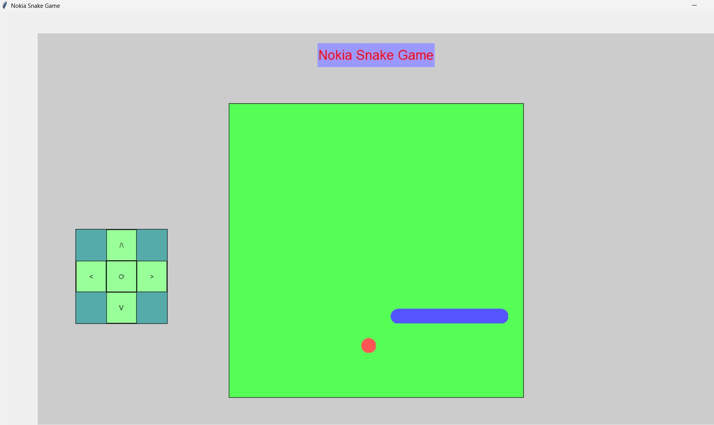

## Install:
- iverilog
- python

## Commands to run:
```bash
iverilog -o tb.vvp tb.v
vvp tb.vvp
python GUI.py
```

## Files involved:
- tb.v
- GUI.py
- File Manager.py

## What tb.v does:
1. It reads the `input.txt` file
2. Applies different conditions like up, down, left, right and apple or wall collision
3. Writes the final state to `output.txt`

## What "File Manager.py" does:
1. Watches the `input.txt` file for any new saves
2. Runs the tb.v file

## What GUI.py does:
1. It writes the user's move into `input.txt` and saves it.
2. This activates the `File Manager.py` file and writes the final state into `output.txt`
3. Reads from `output.txt` and repaints the screen

## What it does overall:
- It writes the input to the `input.txt` file, saves it
- and according to the content of the `output.txt` it repaints the screen
- Details given in `Project Algorithm.txt`

## Demo



